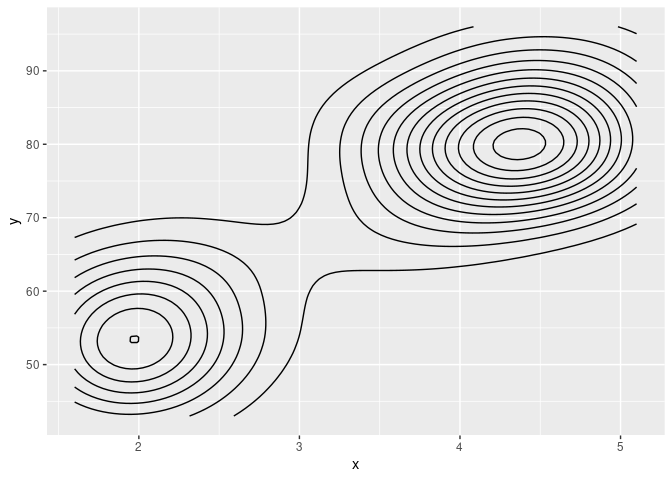

<!-- README.md is generated from README.Rmd. Please edit that file -->

# ggdatasaver

<!-- badges: start -->

[](https://lifecycle.r-lib.org/articles/stages.html#experimental)
[](https://CRAN.R-project.org/package=ggdatasaver)
<!-- badges: end -->

The goal of ggdatasaver is to automatically save the data associated
with your plots for you to share as supplementary material. Other people
can then use that data instead of digitising your plots. Because only
the data already being published as a plot is saved, there should be
fewer privacy or legal complications.

## Installation

You can install the development version of ggdatasaver like so:

``` r
remotes::install_github("eliocamp/ggdatasaver")
```

## Example

ggdatasaver works automatically with knitr. The only thing you need to
do is to define the directory where the data is saved with

``` r
ggdatasaver::plot_data_dir_set("plot-data")
```

Then, just create your ggplot2 figures as always. Using a chunk label is
encouraged because this will be the name of the file.

``` r
library(ggplot2)

ggplot(mtcars, aes(mpg, disp)) +
  geom_point() +
  geom_smooth()
#> `geom_smooth()` using method = 'loess' and formula 'y ~ x'
```


After you knit, you will have a (possibly new) directory with zip files
with the data of each plot.

``` r
fs::dir_tree("plot-data")
#> plot-data
#> └── mpg.zip
```

Inside that zip file there will be a csv file for each layer.

``` r
dir <- file.path(tempdir(), "mpg")
utils::unzip("plot-data/mpg.zip", exdir = dir)
fs::dir_tree(dir)
#> /tmp/RtmpHMyi4g/mpg
#> ├── GeomPoint.csv
#> └── GeomSmooth.csv
```

The data of each layer is only the one used to draw the geometry. For
example, GeomSmooth.csv has the coordinates of the fit and some other
aesthetic information

``` r
smooth <- read.csv(file.path(dir, "GeomSmooth.csv"))
knitr::kable(head(smooth))
```

|        x |        y |     ymin |     ymax |       se | flipped_aes | PANEL | group | colour   | fill   | size | linetype | weight | alpha |
|---------:|---------:|---------:|---------:|---------:|:------------|------:|------:|:---------|:-------|-----:|---------:|-------:|------:|
| 10.40000 | 465.4006 | 380.6647 | 550.1365 | 41.25442 | FALSE       |     1 |    -1 | \#3366FF | grey60 |    1 |        1 |      1 |   0.4 |
| 10.69747 | 455.8367 | 378.8003 | 532.8731 | 37.50585 | FALSE       |     1 |    -1 | \#3366FF | grey60 |    1 |        1 |      1 |   0.4 |
| 10.99494 | 446.3856 | 376.3085 | 516.4627 | 34.11767 | FALSE       |     1 |    -1 | \#3366FF | grey60 |    1 |        1 |      1 |   0.4 |
| 11.29241 | 437.0484 | 373.1735 | 500.9234 | 31.09807 | FALSE       |     1 |    -1 | \#3366FF | grey60 |    1 |        1 |      1 |   0.4 |
| 11.58987 | 427.8262 | 369.3829 | 486.2694 | 28.45362 | FALSE       |     1 |    -1 | \#3366FF | grey60 |    1 |        1 |      1 |   0.4 |
| 11.88734 | 418.7198 | 364.9320 | 472.5076 | 26.18707 | FALSE       |     1 |    -1 | \#3366FF | grey60 |    1 |        1 |      1 |   0.4 |

And the line can be reconstructed exactly from these data.

``` r
ggplot(smooth, aes(x, y)) + 
  geom_ribbon(aes(ymin = ymin, ymax = ymax, fill = I(fill), alpha = I(alpha))) +
  geom_line(aes(colour = I(colour), size = I(size)))
```


