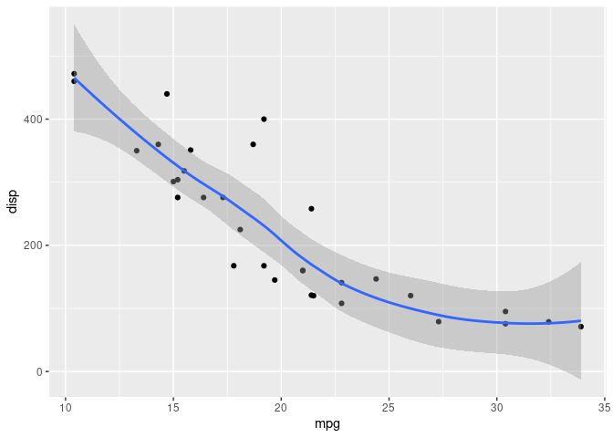
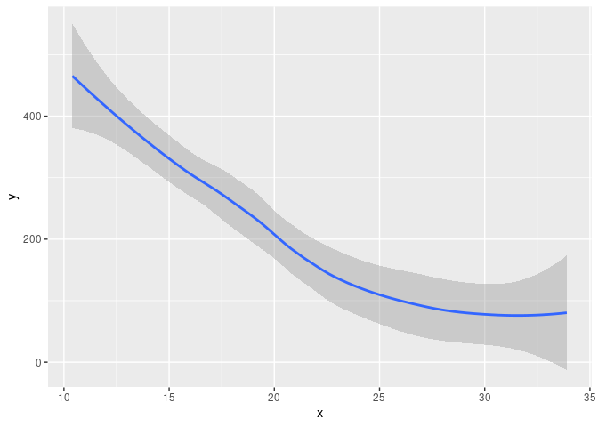
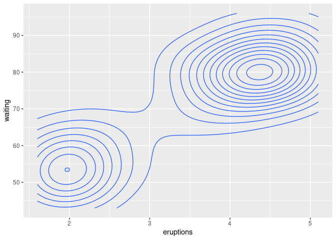

<!-- README.md is generated from README.Rmd. Please edit that file -->

# ggdatasaver

<!-- badges: start -->

[](https://lifecycle.r-lib.org/articles/stages.html#experimental)
[](https://CRAN.R-project.org/package=ggdatasaver)
<!-- badges: end -->

The goal of ggdatasaver is to automatically save the data associated
with your plots for you to share as supplementary material. Other people
can then use that data instead of digitising your plots. Because only
the data already being published as a plot is saved, there should be
fewer privacy or legal complications.

## Installation

You can install the development version of ggdatasaver like so:

``` r
remotes::install_github("eliocamp/ggdatasaver")
```

## Example

ggdatasaver works automatically with knitr. The only thing you need to
do is to define the directory where the data is saved with

``` r
ggdatasaver::save_plot_data_in("plot-data")
```

Then, just create your ggplot2 figures as always. Using a chunk label is
encouraged because it will be used to name the file.

``` r
library(ggplot2)

ggplot(mtcars, aes(mpg, disp)) +
  geom_point() +
  geom_smooth()
#> `geom_smooth()` using method = 'loess' and formula 'y ~ x'
```



After you knit, you will have a (possibly new) directory with zip files
with the data of each plot.

``` r
fs::dir_tree("plot-data")
#> plot-data
#> └── mpg-1.zip
```

Inside that zip file there will be a csv file for each layer.

``` r
# Unzip the contents of mpg.zip into a temporary directory. 
dir <- file.path(tempdir(), "mpg")
utils::unzip("plot-data/mpg-1.zip", exdir = dir)
fs::dir_tree(dir)
#> /tmp/RtmpSKG8kb/mpg
#> ├── GeomPoint.csv
#> └── GeomSmooth.csv
```

The data of each layer is only the one used to draw the geometry. For
example, GeomSmooth.csv has the coordinates of the fit and some other
aesthetic information

``` r
smooth <- read.csv(file.path(dir, "GeomSmooth.csv"))
knitr::kable(head(smooth))
```

|        x |        y |     ymin |     ymax |       se | flipped_aes | PANEL | group | colour   | fill   | size | linetype | weight | alpha |
|---------:|---------:|---------:|---------:|---------:|:------------|------:|------:|:---------|:-------|-----:|---------:|-------:|------:|
| 10.40000 | 465.4006 | 380.6647 | 550.1365 | 41.25442 | FALSE       |     1 |    -1 | \#3366FF | grey60 |    1 |        1 |      1 |   0.4 |
| 10.69747 | 455.8367 | 378.8003 | 532.8731 | 37.50585 | FALSE       |     1 |    -1 | \#3366FF | grey60 |    1 |        1 |      1 |   0.4 |
| 10.99494 | 446.3856 | 376.3085 | 516.4627 | 34.11767 | FALSE       |     1 |    -1 | \#3366FF | grey60 |    1 |        1 |      1 |   0.4 |
| 11.29241 | 437.0484 | 373.1735 | 500.9234 | 31.09807 | FALSE       |     1 |    -1 | \#3366FF | grey60 |    1 |        1 |      1 |   0.4 |
| 11.58987 | 427.8262 | 369.3829 | 486.2694 | 28.45362 | FALSE       |     1 |    -1 | \#3366FF | grey60 |    1 |        1 |      1 |   0.4 |
| 11.88734 | 418.7198 | 364.9320 | 472.5076 | 26.18707 | FALSE       |     1 |    -1 | \#3366FF | grey60 |    1 |        1 |      1 |   0.4 |

And the line can be reconstructed exactly from these data.

``` r
ggplot(smooth, aes(x, y)) + 
  geom_ribbon(aes(ymin = ymin, ymax = ymax, fill = I(fill), alpha = I(alpha))) +
  geom_line(aes(colour = I(colour), size = I(size)))
```



(Setting `plot_data_dir` to `NULL` will suppress data-saving for that
chunk.)

As you can see, only the coordinates of each geom are saved, not the
underlying data. For a more dramatic example, take this controur plot of
the Old Faithful Geyser Data.

``` r
ggplot(faithful, aes(x = eruptions, y = waiting)) +
  geom_density_2d()
```



(Now there are two zip files in the `plot-data` directory

``` r
fs::dir_tree("plot-data")
#> plot-data
#> ├── faithful-density-1.zip
#> └── mpg-1.zip
```

.)

ggdatasaver will save the coordinates that defined the contours, not the
observations from which they were computed.

``` r
dir <- file.path(tempdir(), "faithful-density")
utils::unzip("plot-data/faithful-density-1.zip", exdir = dir)

density <- read.csv(file.path(dir, "GeomDensity2d.csv"))

ggplot(density, aes(x, y)) +
  geom_path(aes(group = group))
```


This makes it safe to share these data, as it doesn’t include any more
information than what’s in the plot you are already sharing.

## Limitations

ggdatasaver has only been tested on simple plots although there’s no
reason it should work work with more complicated ones. Hoever, patchwork
/ cowplot plots probably wont work as expected.

When using ggdatasaver plots are built twice; once when saving the data
and once when drawing the plot. This shouldn’t be an issue most of the
time unless your plot requires heavy computation.
